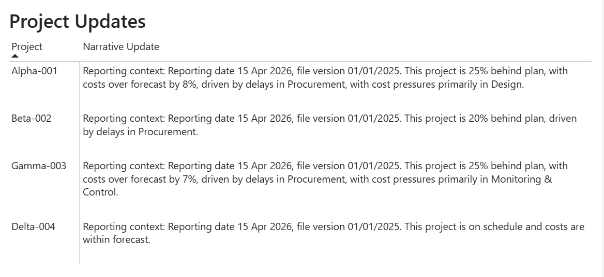

# powerbi-project-reporting-narratives

A collection of **DAX User‑Defined Functions (UDFs)** and supporting measures designed to generate **structured, professional project reporting narratives** in Power BI.

This repository focuses on **project controls use cases**, helping teams explain *what the data means*, not just *what the numbers are*.

---

## Purpose

Project dashboards often present metrics without context, leaving stakeholders asking:

- What reporting period does this relate to?
- Which version or forecast is being used?
- Is the project actually on track?
- What is driving schedule delays or cost overruns?

This repository addresses that gap by providing **standardised narrative patterns** that:

- Clearly state reporting context  
- Explain schedule and cost performance using thresholds  
- Identify which project phases are driving variance  
- Scale from single‑project to portfolio views  

---

## What’s Included

### DAX User‑Defined Functions

- Reporting context narratives
- Schedule and cost status narratives

### Supporting Measures

- Schedule variance
- Cost variance
- Worst‑performing schedule and cost phases
- A single orchestration measure that combines context and status into a final narrative

All narrative logic is **deliberately separated from calculation logic** to keep models auditable, transparent, and maintainable.

---

## Power BI Example and Sample Files

This repository includes a **ready‑to‑use Power BI example** and **sample datasets** to help you test and understand the narrative patterns.

### Power BI Example

- `samples/ProjectNarrativeUDF.zip`

A zipped Power BI example demonstrating:
- Narrative UDF usage
- Required and optional measures
- Project‑level and portfolio‑level narratives
- Schedule and cost performance commentary

Unzip the file and open the `.pbix` in Power BI Desktop to explore the implementation.

### Sample Data Files

- `samples/Sample_ProjectSchedule.xlsx`  
  Example project schedule data by project and phase, suitable for testing:
  - Schedule variance
  - Worst schedule phase
  - Schedule‑driven narrative logic

- `samples/Sample_ProjectCosts.xlsx`  
  Example project cost data by project and phase, suitable for testing:
  - Cost variance
  - Worst cost phase
  - Cost‑driven narrative logic

These files can be imported directly into Power BI and mapped to your model to recreate the narrative outputs shown in the example.

---

### Example Output

Reporting context: Reporting date 31 Mar 2025, file version Forecast v1.
This project is 18% behind plan, with costs over forecast by 7%, driven by delays in Procurement, with cost pressures primarily in Execution.

## Required Measures (High Level)

To use the patterns in this repository, your model will typically include:

- Reporting Date  
- Schedule Version  
- Schedule Variance %  
- Cost Variance %  
- Worst Schedule Phase  
- Worst Cost Phase  

Optional measures (supported but not required):

- SPI  
- CPI  

---

## Intended Use Cases

- Project status tables (project on rows)
- Portfolio summary views
- Management commentary cards
- Tooltips and report headers
- Automated monthly reporting packs

---

## Notes on Scope

These patterns focus on **narrative generation**, not on defining how schedule or cost variance is calculated.  
They are designed to sit **on top of your existing project controls model**.

---

## License

MIT License — free to use, adapt, and extend.

---

## Acknowledgements

Inspired by real‑world PMO and project controls reporting challenges, where clarity, consistency, and auditability matter as much as accuracy.
